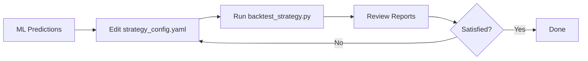
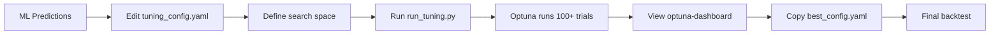

# CCQPF User Guide

**Category-based Quarterly Portfolio Framework** – A backtesting framework for Indian equity portfolio strategies using ML probability scores.

---

## Welcome!

If you've trained a machine learning model to predict stock performance and want to test how it would perform in a real-world portfolio strategy, you're in the right place. CCQPF (Category-based Quarterly Portfolio Framework) helps you:

- ✅ **Select stocks** each quarter using your ML model's probability scores
- ✅ **Simulate realistic trading** with configurable exit strategies (take profit, stop loss)
- ✅ **Benchmark performance** against market indices (e.g., Nifty 50)
- ✅ **Optimize parameters** automatically using hyperparameter tuning
- ✅ **Generate professional reports** with comprehensive metrics and visualizations

**Who is this for?** Data scientists and ML practitioners who want to backtest quantitative strategies without building backtesting infrastructure from scratch.

---

## Table of Contents

- [What You Need](#what-you-need)
- [Quick Start: Your First Backtest](#quick-start-your-first-backtest)
- [Understanding the Workflow](#understanding-the-workflow)
- [Next Steps](#next-steps)
- [Getting Help](#getting-help)

---

## What You Need

### Prerequisites

Before you begin, make sure you have:

1. **Python Environment** (3.8+)
   - Install dependencies: `pip install -r requirements.txt`

2. **ML Inference Data** – Your model's predictions in CSV/Parquet format:
   ```
   quarter, co_name, prob
   202002, Reliance Industries, 0.85
   202002, HDFC Bank, 0.72
   ...
   ```
   - `quarter`: Integer format YYYYMM (e.g., 202002, 202405, 202408, 202411)
   - `co_name`: Stock name (must match price data)
   - `prob`: Probability score from your ML model (0 to 1)

3. **Price Data** – Historical OHLCV (Open, High, Low, Close, Volume):
   ```
   date, co_name, open, high, low, close
   2020-02-15, Reliance Industries, 1450.0, 1475.0, 1440.0, 1460.0
   ```

4. **Index Data** – Benchmark index values (e.g., Nifty 50):
   ```
   date, value
   2020-02-15, 12000.5
   ```

> **Note**: All data files should be placed in the `data/` directory. See [CONFIGURATION_REFERENCE.md](CONFIGURATION_REFERENCE.md#data-requirements) for detailed format specifications.

---

## Quick Start: Your First Backtest

**Goal**: Run a simple backtest in ~15 minutes to see how your ML predictions perform as a portfolio strategy.

### Step 1: Prepare Your Data

Place your files in the `data/` directory:
```
ccqpf/
  data/
    inference_data.csv          # Your ML predictions
    price_data/ohlcv.parquet    # Historical prices
    index_data/nifty50.csv      # Benchmark index
```

### Step 2: Configure the Backtest

Open `src/strategy_config.yaml` and update three key sections:

**A. Set your data paths** (relative to `src/` directory):
```yaml
input_data_path: "../data/inference_data.csv"
price_data_path: "../data/price_data/ohlcv.parquet"
index_data_path: "../data/index_data/nifty50.csv"
```

**B. Define the backtest period**:
```yaml
first_quarter: 202002  # Start from Feb 2020
last_quarter: 202411   # End at Nov 2024
```

**C. Choose a simple strategy** (we'll start basic):
```yaml
# Stock Selection
selection_type: 'top_k'           # Simple: pick top N stocks
top_k_config:
  k: 30                           # Select 30 stocks per quarter
  weighting_scheme: 'equal'       # Equal money across all stocks

selection_method: 'probability'   # Rank by ML probability
min_prob_threshold: 0.5          # Only consider prob >= 0.5

# Exit Strategy (simple percentage-based)
tp_enabled: true                  # Enable take profit
sl_enabled: true                  # Enable stop loss
tpsl_mode: 'flat'                 # Same % for all stocks

flat_config:
  tp_pct: 0.10                    # Exit at +10% profit
  sl_pct: 0.05                    # Exit at -5% loss

# Reports
generate_analysis_report: true
generate_detailed_report: true
```

> **What this does**: Each quarter, select the top 30 stocks by probability (≥0.5), invest equal amounts, exit when a stock hits +10% profit or -5% loss (or at quarter end), then compare to the index.

### Step 3: Run the Backtest

Open a terminal and run:

```bash
cd src
python backtest_strategy.py
```

You'll see output like:
```
Loading data...
Running backtest from 202002 to 202411...
Quarter 202002: Selected 30 stocks, simulating trades...
Quarter 202405: Selected 30 stocks, simulating trades...
...
Backtest complete!
Generating reports...
Results saved to: ../backtesting_results/run_20260211_094957/
```

### Step 4: Review Results

Navigate to `backtesting_results/run_<timestamp>/` to find:

📊 **Key Files**:
- `MO_report.xlsx` – **Start here!** Comprehensive performance summary with charts
- `analysis_report.xlsx` – Detailed metrics (CAGR, Sharpe ratio, drawdown, etc.)
- `trade_results.csv` – Individual trade details (entry/exit prices, returns)
- `portfolio_vs_index.csv` – Daily portfolio value vs benchmark
- `plots/` – Visualizations (drawdown curve, return distributions, etc.)

**Quick Health Check**:
1. Open `MO_report.xlsx` → "Since Inception" sheet
2. Look for:
   - **CAGR** (Compound Annual Growth Rate): Is it positive? Higher than the index?
   - **Max Drawdown**: How much did the portfolio fall from peak? (Lower is better)
   - **Sharpe Ratio**: Risk-adjusted return (>1.0 is good, >2.0 is excellent)

🎉 **Congratulations!** You've run your first backtest. 

---

## Understanding the Workflow

CCQPF supports two main workflows:

### Workflow A: Single Backtest (Strategic Exploration)



**Use when**: Testing specific strategy ideas, generating reports for stakeholders, understanding how different exit strategies work.

**Time**: ~1-5 minutes per run (depending on data size and quarter range)

### Workflow B: Hyperparameter Tuning (Optimization)



**Use when**: You want to find optimal parameters automatically instead of manual trial-and-error. Systematically search combinations of stock selection methods, exit strategies, thresholds, etc.

**Time**: 30 minutes to several hours (depending on search space size and trial count)

---

## Next Steps

### Learn the Strategic Options

Read [STRATEGIC_OPTIONS.md](STRATEGIC_OPTIONS.md) to understand:
- **Stock selection strategies**: Should you use category-based diversification (by volatility or market cap) or simple top-K ranking?
- **Exit strategies**: Fixed %, volatility-based (ATR), support/resistance levels (pivots), or hold until quarter-end?
- **Advanced features**: Market regime filters, dynamic TP/SL adjustment based on index volatility

### Master Configuration

See [CONFIGURATION_REFERENCE.md](CONFIGURATION_REFERENCE.md) for:
- Complete parameter reference with examples
- Data format requirements in detail
- Quarter encoding conventions
- Special modes (preselected portfolios, category schemes)

### Optimize Your Strategy

Read [TUNING_GUIDE.md](TUNING_GUIDE.md) to:
- Set up automated parameter optimization with Optuna
- Define search spaces for your parameters
- Choose objectives (Calmar ratio, CAGR, max drawdown)
- Interpret tuning results and avoid overfitting

### Understand Your Results

See [OUTPUTS_AND_METRICS.md](OUTPUTS_AND_METRICS.md) for:
- Detailed explanation of every output file
- Performance metrics demystified (Sharpe, Sortino, Calmar, VaR, etc.)
- Benchmark comparison metrics (Beta, Tracking Error, Information Ratio, Alpha)
- How to interpret charts and identify patterns

---

## Getting Help

### Troubleshooting Common Issues

**❌ "FileNotFoundError" when running backtest**
- Check that data paths in `strategy_config.yaml` are correct relative to `src/` directory
- Verify files exist in `data/` folder

**❌ "Many stocks filtered out due to insufficient price data"**
- Ensure price data covers all quarters in your backtest range
- Check that `co_name` values match exactly between inference and price data

**❌ "KeyError: 'category'" or "KeyError: 'volatility'"**
- If using `category_scheme: 'volatility'`, your inference data needs a `volatility` column
- If using `category_scheme: 'mcap'`, your inference data needs a `category` column with values: `largecap`, `midcap`, `smallcap`
- Solution: Switch to `selection_type: 'top_k'` which doesn't need categories, or add the required column

**❌ "Backtest results seem unrealistic (CAGR > 100%)"**
- Check for data quality issues (corporate actions not adjusted, wrong prices)
- Review `trade_results.csv` for anomalies
- Consider narrowing the backtest period or adding `min_prob_threshold`

**❌ "Tuning runs very slowly"**
- Reduce `n_trials` in `tuning_config.yaml` or via `--n-trials` flag
- Set `validate_input_data: false` in tuning config (after validating once manually)
- Narrow the date range (`first_quarter`/`last_quarter`)

### Reference Documentation

For deeper technical details, see the `docs/` folder:
- [atr_explained.md](atr_explained.md) – How Average True Range volatility works
- [pivot_points_explained.md](pivot_points_explained.md) – Support/resistance level theory
- [benchmark_metrics.md](benchmark_metrics.md) – Beta, Tracking Error, Information Ratio formulas
- [stock_selection_design.md](stock_selection_design.md) – Selection paradigm architecture notes

### Important Conventions

- **Working Directory**: Always run scripts from `src/` directory: `cd src && python backtest_strategy.py`
- **Quarter Format**: Quarters are encoded as `YYYYMM` where MM ∈ {02, 05, 08, 11}
  - `202002` = Feb-May 2020
  - `202405` = May-Aug 2024
  - `202408` = Aug-Nov 2024
  - `202411` = Nov 2024-Feb 2025
- **Initial Capital**: Hardcoded to ₹100 Crores (1 billion rupees) for position sizing
- **Risk-Free Rate**: Hardcoded to 6.5% (Indian market) for Sharpe/Sortino calculations
- **File Paths**: All config paths are relative to `src/` directory (e.g., `../data/...`)

---

## Configuration Templates

The framework provides template files to help you get started:

- `src/strategy_config_template.yaml` – Example backtest configuration with comments
- `src/tuning_config_template.yaml` – Example tuning configuration with search space examples

Copy these to `strategy_config.yaml` / `tuning_config.yaml` and customize for your needs.

---

## Key Concepts at a Glance

| Concept | What It Means | Why It Matters |
|---------|---------------|----------------|
| **Quarter** | 3-4 month trading period (Feb, May, Aug, Nov) | Portfolio rebalances every quarter |
| **TP (Take Profit)** | Exit when stock gains X% | Locks in profits |
| **SL (Stop Loss)** | Exit when stock loses X% | Limits downside risk |
| **CAGR** | Compound Annual Growth Rate | How fast your capital grows |
| **Sharpe Ratio** | Return per unit of volatility | Risk-adjusted performance |
| **Max Drawdown** | Worst peak-to-trough decline | How much you could lose |
| **Calmar Ratio** | CAGR ÷ Max Drawdown | Return per unit of drawdown risk |

---

**Ready to dive deeper?** Continue to [STRATEGIC_OPTIONS.md](STRATEGIC_OPTIONS.md) to learn about all available strategies and when to use them.

---

*Last updated: February 2026*
